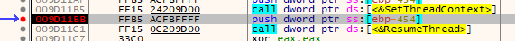
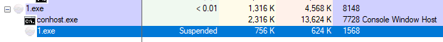
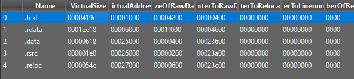
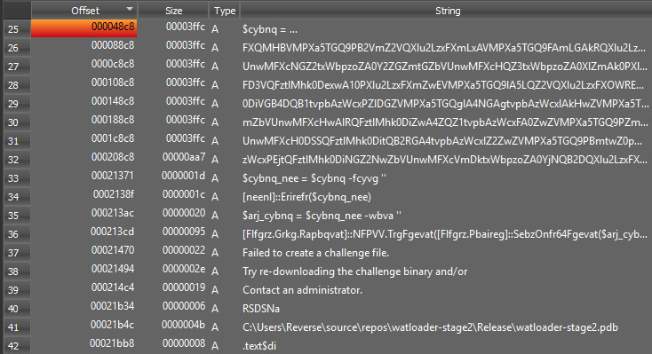
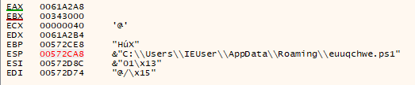
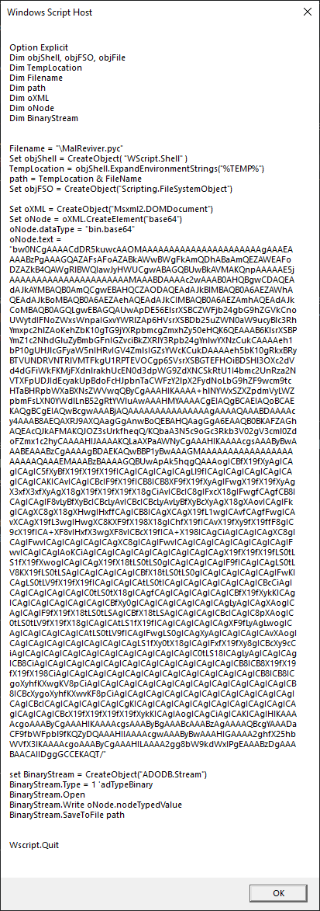
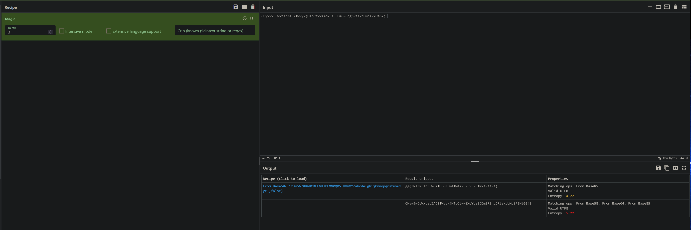

# Watloader
<br>

# Summary

We are given a *PE32* executable which by the description might be malicious. By analyzing the binary we can notice that the executable uses quite a common and known code injection technique in malware campaigns known as *Process Hollowing*. By Running the executable file under a debugger we can manage to dump the created process which leads us to a *ROT13* obfuscated string. When the string is then deobfuscated we see that it's a powershell script which drops a *.VBS* file in the users *USERPROFILE* folder. When we look at the vbs file we see yet another file being deobfuscated and written to disk but this time it's a python *.pyc* file. Navigating to the path where the script drops we can analyze the python byte compiled file and determine that the script simply returns the flag but the flag is obfuscated. By taking the flag and letting *Cyberchef* deal with the obfuscation by using the *Magic* operation we see that *Cyberchef* decodes our flag as *base58*. 
<br>
<br>


# Static analysis of the executable

We start off by looking at the strings present in the binary. When we look at the strings we can see that we have some peculiar strings such as the string 
**"The program can't start because MSVCP110.dll is missing from your computer. Try reinstalling the program to fix this problem."** and the most interesting one being `"$cybnq = 'cLTolAzL2M...` This looks like an obfuscated string, we can look at some basic ciphers online and maybe get somewhere with it but instead let's look at the executable in *Ghidra*.  When we look for the missing dll string in ghidra we are brought to a function where the string is used, the decompiled function looks something like this
<br>
<br>

```c

undefined4 FUN_004011e0(void)

{
  HWND hWnd;
  int nCmdShow;
  
  nCmdShow = 0;
  hWnd = GetConsoleWindow();
  ShowWindow(hWnd,nCmdShow);
  FUN_00401000();
  MessageBoxA((HWND)0x0,"The installation will now check the filesystem for necessary DLL\'s",
              "Thank you for using Driver Reviver",0x40);
  MessageBoxA((HWND)0x0,
              "The program can\'t start because MSVCP110.dll is missing from your computer. Try rein stalling the program to fix this problem."
              ,"System Error",0x10);
  return 0;
}

```

This looks like the main function of the binary. We quickly see here that the executable is using a call to *MessageBoxA* to fool the user into thinking that a DLL is missing from the computer, we also see one unknown function call being made to the function `FUN_00401000()` Let's look at that function.
<br>
<br>


## Process Hollowing (RunPE)
This is an instant red flag, essentially what we have here is a famous code injection technique known as *Process Hollowing*. By utilizing this technique it's possible for an attacker to run malicious code in a legitimate process e.g explorer.exe. When *Process Hollowing* is used a process is created in a suspended state, the spawned process is then modified in memory to replace the legitimate contents of the process with the attackers malicious code. Then the process is resumed leading to the parent program executing the attackers injected code. Let's look at the code and make some sense of it.

```c

int RunPortableExecutable(void *Image)

{
  BOOL createproc_ret;
  LPCONTEXT ContextStruct;
    /*Struct to access processor-specific register data*/
  LPVOID lpBaseAddress;
  int iVar1;
  int iVar2;
  undefined extraout_DL;
  undefined extraout_DL_00;
  undefined extraout_DL_01;
  undefined extraout_DL_02;
  undefined uVar3;
  int iVar4;
  int iVar5;
  undefined in_stack_fffffb98;
  LPCONTEXT pCVar6;
  DWORD lpBuffer;
  _PROCESS_INFORMATION PI_struct;
  /*Struct containing information about a newly created process*/
  _STARTUPINFOA SI_struct;
  /*Struct that controls the appearance of the main window for a process*/
  CHAR FilePath [1024];
  uint local_8;
  
  iVar1 = DAT_00403054;
  local_8 = DAT_00403004 ^ (uint)&stack0xfffffffc;
  GetModuleFileNameA((HMODULE)0x0,FilePath,0x400);
  uVar3 = extraout_DL;
                    /* Validate PE header (Check if Image is a PE) */
  if (*(int *)((int)&lpBuffer_00403018 + iVar1) == IMAGE_NT_SIGNATURE) {
                    /* Null memory (Null out struct)*/
    PI_struct = ZEXT816(0);
                    /* Null memory (Null out struct)*/
    memset(&SI_struct,0,0x44);
    createproc_ret =
         CreateProcessA(FilePath,(LPSTR)NULL,(LPSECURITY_ATTRIBUTES)NULL,(LPSECURITY_ATTRIBUTES)NULL
                        ,FALSE,CREATE_SUSPENDED,(LPVOID)NULL,(LPCSTR)NULL,&SI_struct,&PI_struct);
    uVar3 = extraout_DL_00;
                    /* Create a process in a suspended state (CREATE_SUSPENDED) */
    if (createproc_ret != 0) {
      ContextStruct = (LPCONTEXT)VirtualAlloc((LPVOID)NULL,4,MEM_COMMIT,PAGE_READWRITE);
      ContextStruct->ContextFlags = WOW64_CONTEXT_FULL;
      pCVar6 = ContextStruct;
      createproc_ret = GetThreadContext(PI_struct.hThread,ContextStruct);
      uVar3 = extraout_DL_01;
      if (createproc_ret != 0) {
        ReadProcessMemory(PI_struct.hProcess,(LPCVOID)(ContextStruct->Ebx + 8),&lpBuffer,4,
                          (SIZE_T *)NULL);
        lpBaseAddress =
             VirtualAllocEx(PI_struct.hProcess,*(LPVOID *)(iVar1 + 0x40304c),
                            *(SIZE_T *)(s_!This_program_cannot_be_run_in_D_00403065 + iVar1 + 3),
                            0x3000,0x40);
             /*Allocate Space for the Shellcode */
        WriteProcessMemory(PI_struct.hProcess,lpBaseAddress,&lpBuffer_00403018,
                           *(SIZE_T *)(s_!This_program_cannot_be_run_in_D_00403065 + iVar1 + 7),
                           (SIZE_T *)0x0);
        iVar5 = 0;
        if (*(short *)(iVar1 + 0x40301e) != 0) {
          iVar4 = 0;
          ContextStruct = pCVar6;
          do {
            iVar2 = DAT_00403054 + iVar4;
            WriteProcessMemory(PI_struct.hProcess,
                               (LPVOID)(*(int *)(iVar2 + 0x40311c) + (int)lpBaseAddress),
                               (LPCVOID)((int)&lpBuffer_00403018 + *(int *)(iVar2 + 0x403124)),
                               *(SIZE_T *)(iVar2 + 0x403120),(SIZE_T *)0x0);
            iVar5 = iVar5 + 1;
            iVar4 = iVar4 + 0x28;
            pCVar6 = ContextStruct;
          } while (iVar5 < (int)(uint)*(ushort *)(iVar1 + 0x40301e));
          /*Write the shellcode to the suspended process*/
        }
        WriteProcessMemory(PI_struct.hProcess,(LPVOID)(ContextStruct->Ebx + 8),
                           (LPCVOID)(iVar1 + 0x40304c),4,(SIZE_T *)0x0);
        ContextStruct->Eax = *(int *)(iVar1 + 0x403040) + (int)lpBaseAddress;
        SetThreadContext(PI_struct.hThread,ContextStruct);
        /*Point the entrypoint to a new code section*/
        ResumeThread(PI_struct.hThread);
                    /* Move to the entry point of the created process and resume program execution
                        */
        uVar3 = extraout_DL_02;
      }
      in_stack_fffffb98 = SUB41(pCVar6,0);
    }
  }
  iVar1 = FUN_0040121f(local_8 ^ (uint)&stack0xfffffffc,uVar3,in_stack_fffffb98);
  return iVar1;
}
```
 Here we have the code somewhat readable atleast the most important parts. So in short the function creates a process in a suspended state, does some basic checks, then it writes the attacker code into the created process and moves the entry point of the created process to make the parent process point to the `main()` function of the suspended process, then we simply resume the process.
<br>
<br>


 ## Dynamic analysis (dumping the process)

 Now that we know that some code gets injected into another process let's look at the parent process under a debugger and let's place a breakpoint right before the call to `ResumeThread()` because we know that the spawned child executable is fully ready to execute after `ResumeThread()` is called that means that we should get a good dump of the executable if we dump it right before detonation. Here we can use a tool called `pe-sieve` to help us get a fully functional dump which saves us from having to manually fix the dump later ourselves.
 <br>
 <br>


<br>
*Breakpoint before ResumeThread()*
<br>
<br>


<br>
 *1.exe (Driver Reviver.exe renamed) child process created in a suspended state*
<br>
<br>

From here we can run the tool `pe-sieve` to dump the created process by passing in a process id like so `pe-sieve.exe /pid <PID>`

```
C:\Users\IEUser\Desktop\sample
λ pe-sieve.exe /pid 1568
PID: 1568
Output filter: no filter: dump everything (default)
Dump mode: autodetect (default)
[*] Using raw process!
Scanning workingset: 39 memory regions.
[!] Scanning detached: 00000000009D0000 : C:\Users\IEUser\Desktop\sample\1.exe
[!] Scanning detached: 0000000077B70000 : C:\Windows\SysWOW64\ntdll.dll
[!] Scanning detached: 00007FF87BD80000 : C:\Windows\System32\ntdll.dll
[*] Workingset scanned in 63 ms
[+] Report dumped to: process_1568
[*] Dumped module to: C:\Users\IEUser\Desktop\sample\\process_1568\400000.exe as UNMAPPED
[+] Dumped modified to: process_1568
[+] Report dumped to: process_1568
---
PID: 1568
---
SUMMARY:

Total scanned:      3
Skipped:            0
-
Hooked:             0
Replaced:           0
Hdrs Modified:      0
IAT Hooks:          0
Implanted:          1
Implanted PE:       1
Implanted shc:      0
Unreachable files:  0
Other:              0
-
Total suspicious:   1
---
```

Sweet! Now under `C:\Users\IEUser\Desktop\sample` we should see a directory named `process_<PID>` if we look into that directory we should have an executable. Now we can verify the integrity of our dump by opening the executable with programs such as *Detect It Easy (DIE)* or *PeStudio*
<br>
<br>


<br>

<br>

<br>
<br>

As we can see the binary seems to be intact, so we can say that we successfully managed to dump the process.

<br>
<br>

# Stage 2

Now it's time to see what our payload actually does. Here we have two choices, we can either look at the executable under a debugger or run the executable and monitor it's behaviour with something like **Procmon**. Here i'll be using **x32dbg** to analyze the binary. Let's open up the debugger and have a look at the *symbols* tab, we can see that we have some interesting imports such as `fwrite()` and `getenv()`. We seem to have some obfuscated strings in the binary which we haven't looked at yet, let's now have a look at them in the debugger. First let's Run to user code then we can place a breakpoint at `fwrite()` fwrite is interesting because it indicates that there is some file writing going on, we might find something interesting getting written to a file. Now hit run in the debugger, execute til return then we step over making the debugger stepout of the function call.
<br>
<br>


<br>
*After fwrite() call*
<br>
<br>


<br>
*The Deobfuscated payload string*
<br>
<br>

If we look at what `ESP` points to we see our deobfuscated string, this is great news for us. We now know that some obfuscated strings in the binary get deobfuscated and written to a file somewhere. Let's find out where these strings are being written to. We can do this by restarting the debugger and instead of placing a breakpoint on the `fwrite()` call we can break on `open()` then we follow the same steps as before and look at our `ESP` register
<br>


<br>
*The path to the payload*
<br>
<br>


Here we go now we know where the shellcode is being written to. After looking around in the debugger for some potential code that executes the dropped file, we don't get anywhere. This means that our dropped file doesn't get executed at all only written to. Now that we have verified that running the binary is safe, let's fire it up!
<br>
<br>

# Stage 3

As we know after running the binary a powershell script gets placed in our ***%APPDATA%** folder. Let's analyze the dropped powershell script

```powershell
$pload = <payload>
$pload_arr = $pload -split ''
[array]::Reverse($pload_arr)
$new_pload = $pload_arr -join ''
[System.Text.Encoding]::ASCII.GetString([System.Convert]::FromBase64String($new_pload)) | out-file -Encoding 'ASCII' $env:USERPROFILE\xvchgjfyefs.vbs
```

This looks very interesting, by reading the powershell code we see that `$pload` holds a reversed base64 string which holds out fourth stage payload. We can also see that after the base64 strings is un-reversed and decoded it gets written to a file called `xvchgjfyefs.vbs` in our **%USERPROFILE%** folder. Again we don't see any code inside our powershell script which executes the dropped file, this means that we can again run the powershell script to get to our fourth stage payload without the need of manual deobfuscation.
<br>
<br>

# Stage 4

Navigating to our **%USERPROFILE%** folder we see our *VBS* file `xvchgjfyefs.vbs` Let's analyze it

```
Execute chr(557424/CLng(&H1B90))&chr(649152/CLng(&H16A4))&chr(350320/CLng(&HBCC))
<...>
```

Now here we have to be careful. The first line in our *VBS* file tells us that the obfuscated code does get executed when we run the file, So now our job is to deobfuscate the obfuscated file and determine what gets executed. Thankfully this is a very weak *VBS* obfuscation technique which makes our lives a bit easier. The reason why this obfuscation technique is weak is because we can replace the `Execute` command with a simple `WScript.echo` function, this is equivalent to the `print()` function in *Python*. Let's swap the commands and run the script.
<br>
<br>


<br>
*Deobfuscated VBS script*
<br>
<br>

After reading the deobfuscated *VBS* code we see that the script creates a file named `MalReviver.pyc`, decodes some *base64* data then writes the decoded content to the *.pyc* file which is then placed in our *%TEMP%* folder. And last but not least we don't see any piece of code that executes the *VBS* code, so let's again swap the commands and re-run the script and analyze our next stage.
<br>
<br>


# Stage 5 - Final stage

Now we have a byte-compiled python script, to be able to analyze the python file we first have to decompile the *.pyc*. We have some tools to do that for us e.g *uncompyle6*, *pycdc*, *pydisasm* etc. I'll be using the tool *pydisasm* which comes pre-installed in **FlareVM**, the tool simply takes our python byte-code file as input and disassembles it for us, let's have a look 
 `pydisasm.exe <Path to file> > <Path to out-file>`

```
  3:           0 LOAD_GLOBAL          (print)
               2 LOAD_GLOBAL          (ascii_art)
               4 CALL_FUNCTION        0
               6 CALL_FUNCTION        1
               8 POP_TOP

  4:          10 LOAD_GLOBAL          (load_prompt)
              12 LOAD_CONST           ('[+] Beacon loaded\n')
              14 CALL_FUNCTION        1
              16 POP_TOP

  5:          18 LOAD_GLOBAL          (load_prompt)
              20 LOAD_CONST           ('[+] ShellZzZ loaded\n')
              22 CALL_FUNCTION        1
              24 POP_TOP

  6:          26 LOAD_GLOBAL          (load_prompt)
              28 LOAD_CONST           ('[+] Connections established\n\n')
              30 CALL_FUNCTION        1
              32 POP_TOP

  7:          34 LOAD_GLOBAL          (load_prompt)
              36 LOAD_CONST           ('[+] Locating flag.txt\n')
              38 CALL_FUNCTION        1
              40 POP_TOP

  8:          42 LOAD_GLOBAL          (time)
              44 LOAD_METHOD          (sleep)
              46 LOAD_CONST           (1)
              48 CALL_METHOD          1
              50 POP_TOP

  9:          52 LOAD_GLOBAL          (load_prompt)
              54 LOAD_CONST           ('[+] Obfuscating flag for detection bypass\n')
              56 CALL_FUNCTION        1
              58 POP_TOP

 10:          60 LOAD_GLOBAL          (time)
              62 LOAD_METHOD          (sleep)
              64 LOAD_CONST           (2)
              66 CALL_METHOD          1
              68 POP_TOP

 11:          70 LOAD_GLOBAL          (load_prompt)
              72 LOAD_CONST           ('[?] Preparing to exfil flag\n\n')
              74 CALL_FUNCTION        1
              76 POP_TOP

 12:          78 LOAD_GLOBAL          (time)
              80 LOAD_METHOD          (sleep)
              82 LOAD_CONST           (3)
              84 CALL_METHOD          1
              86 POP_TOP

 13:          88 LOAD_GLOBAL          (load_prompt)
              90 LOAD_CONST           ('[+] FLAG SUCCESSFULLY STOLEN\n\n')
              92 CALL_FUNCTION        1
              94 POP_TOP

 14:          96 LOAD_GLOBAL          (print)
              98 LOAD_CONST           ('[+] FLAG: CHyw9w6uWxtabZAJ21WvykjHTpCtwwiXoYusBJDmSR8ng6RtskcUMqiP2HtG2jE')
             100 CALL_FUNCTION        1
             102 POP_TOP
             104 LOAD_CONST           (None)
             106 RETURN_VALUE

```
Here is our bytecode disassembly. This looks very simple, firstly we see that we have two custom functions in the script `ascii_art()` and `load_prompt()`. The function ascii art is pretty self-explanatory but the function simply prints out some ascii art to the terminal, then we have the other function which simply writes and flushes the *stdout* buffer which creates the effect of each letter being written one at a time to the terminal. The most important thing here for us is the string `[+] FLAG: <...>`. There doesn't seem to be any deobfuscation/decoding routine in the script to get to another stage so this must be it. Let's try to retrieve the final flag, we know that the flag format should be `gg{.*}` so this string might be obfuscated or encoded in some way.
<br>
<br>

# Decoding the flag

The first page to visit when dealing with any kinds of obfuscations, ciphers and encodings is [CyberChef](https://gchq.github.io/CyberChef/) The Cyber Swiss Army Knife - a web app for encryption, encoding, compression and data analysis. We can simply paste our string in the input window and use the **Magic** operation in cyberchef and see where it takes us


<br>
*Decoded Base58 Flag*
<br>
<br>

Bingo! Our flag turned out to be *Base58* encoded. Here is our final flag **gg{3NT3R_Th3_W021D_0f_M41W42R_R3v3R51N9!?!!?!}**
