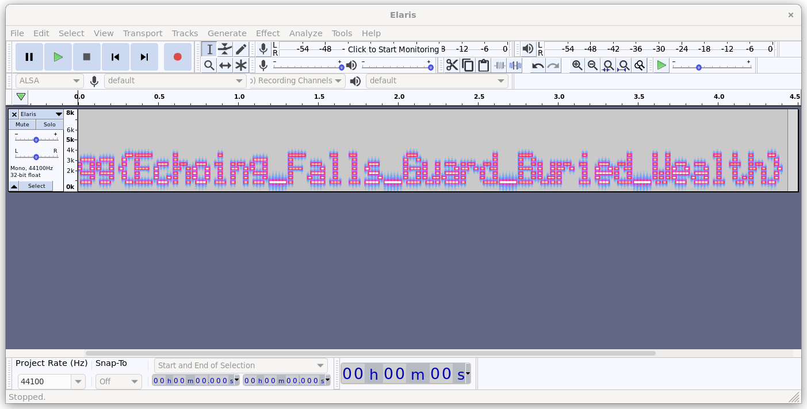

# Elaris-2

Here we have a `.WAV` file which plays strange noises. When dealing with such audio files it's very common that there is something hidden in the audio waves, when we look at the audio waves in spectrogram view with a tool like `audacity` the flag is revealed

 
*Figure 1: Spectrogram view in audacity*
 
 

`gg{Echoing_Falls_Guard_Buried_Wealth}`
