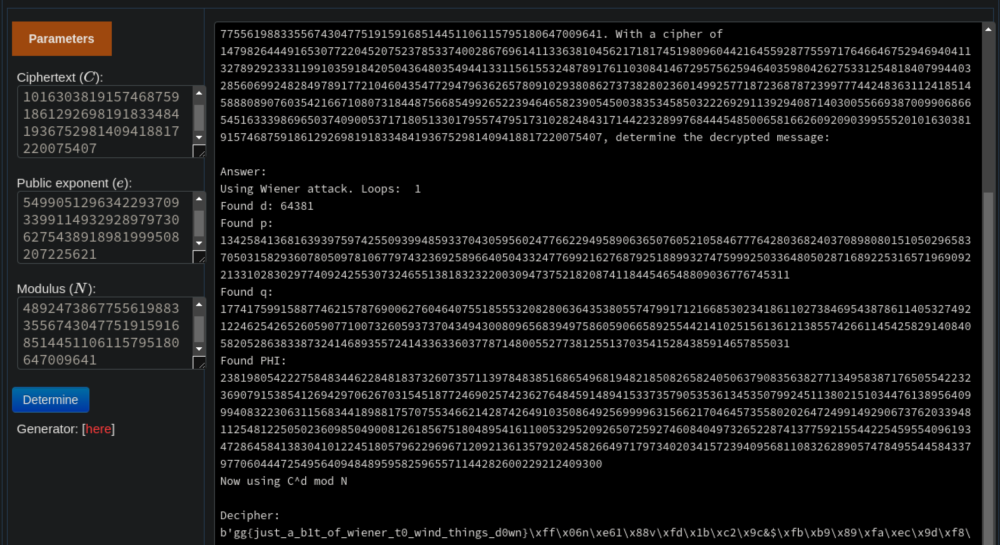

# Wiending things down
In this problem you are given a challenge file that looks to be RSA encryption where the d is first decided to be a 16 bit prime and then e is calculated from that value.

Since the decryption key is so small, we can use a wiener attack to decrypt the values and get the flag.

Luckily this is a well known attack so all we have to do is google for wiener rsa decryption online and we throw the values into one of the decryptors and get the flag.

